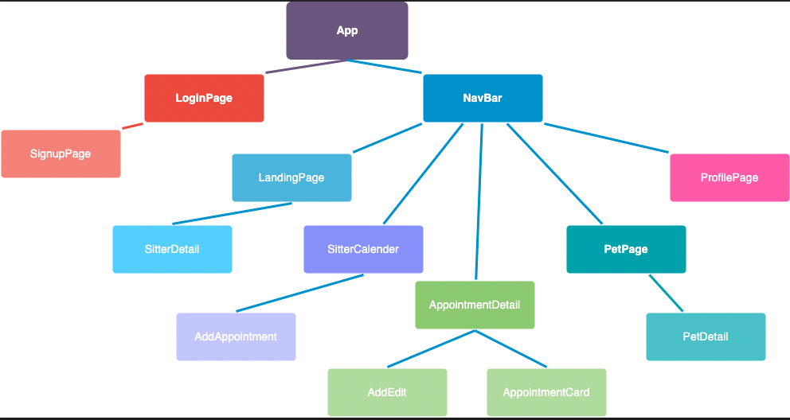
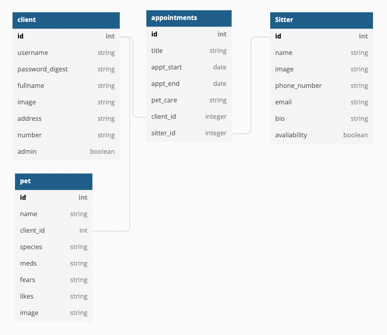
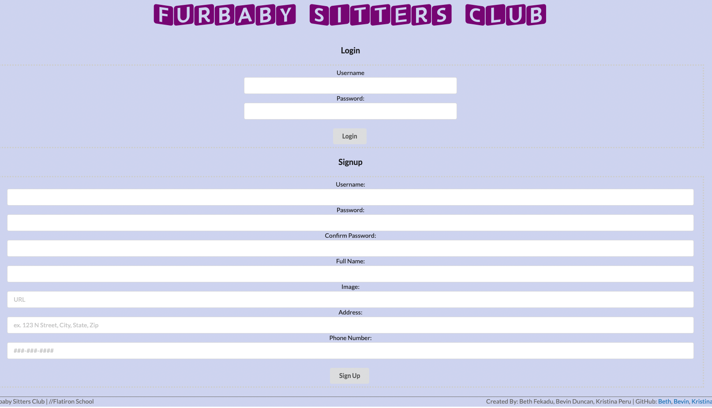
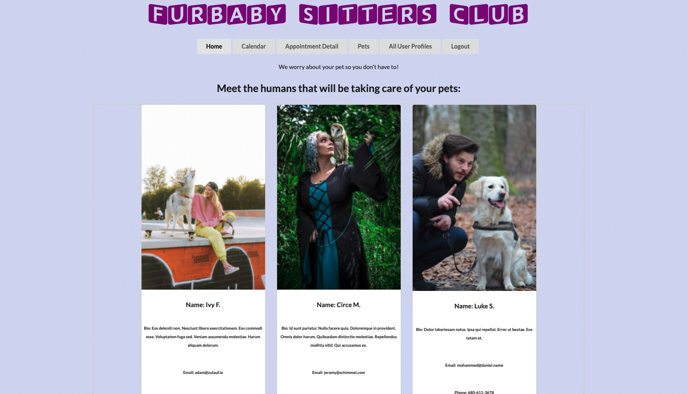
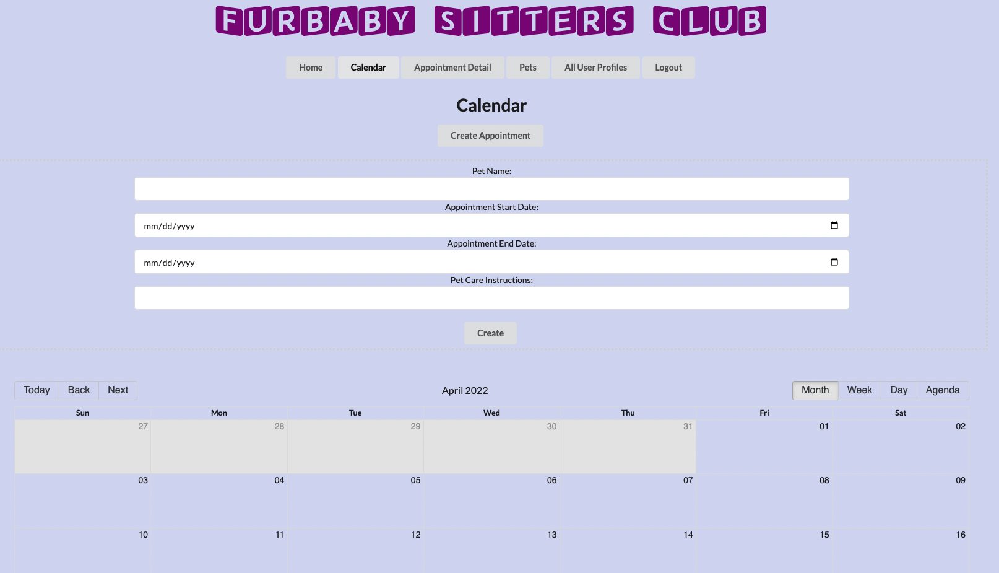
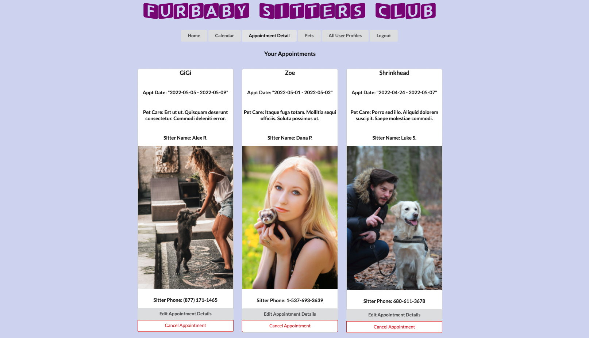
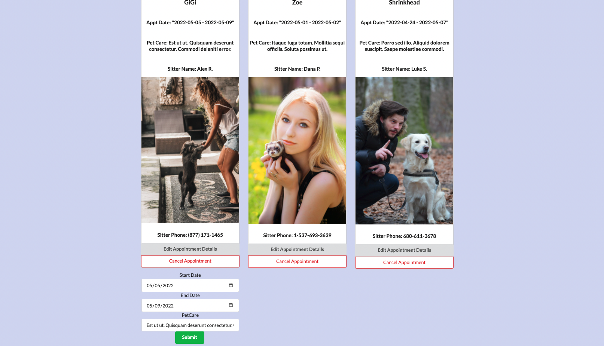
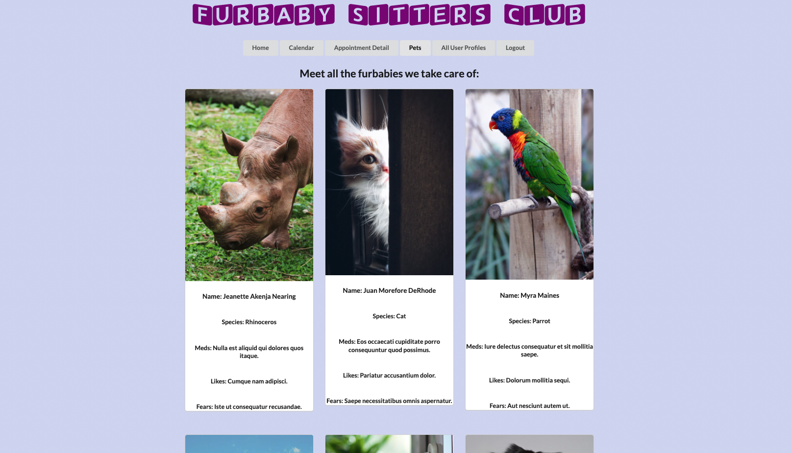
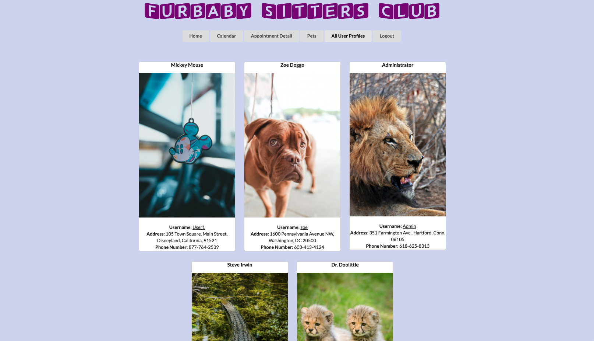
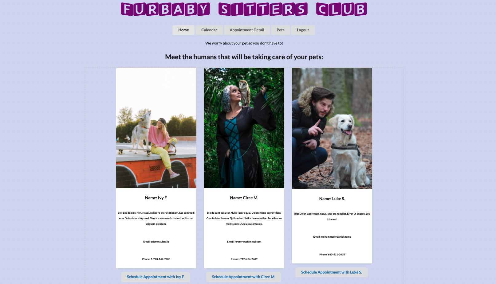

# Fur Baby Sitters Club

This application is used to book a pet-sitting session for your favorite pet.

## Front End

The front-end of the website is built using React.
`npm start --prefix client` runs the app in the development mode.
Open [http://localhost:4000](http://localhost:4000) to view it in the browser.

## Back End

The back-end of the website is built using Ruby on Rails.
`rails s` runs the back-end of the app in the development mode.
Open [http://localhost:3000](http://localhost:3000) to view it in the browser.

## User Stories

The application allows the user to 
  * Signup for an account
  * Login/logout
  * View all sitters
  * View calendar of available appointments
  * Create an appointment 
  * View appointment details
  * Edit, cancel/delete an appointment
  * View all pets
  * View all user profiles (Admin only)

## Styling

This application uses semantic UI and some css code for styling.

Logo font is from Font Space "SquareKids-LZ5y.tff"

All stock photos are from [Pexels](https://www.pexels.com/).

## Authors

Bevin Duncan: https://github.com/bevin-duncan

Kristina Peru: https://github.com/krisperu

Beth Fekadu: https://github.com/8eth